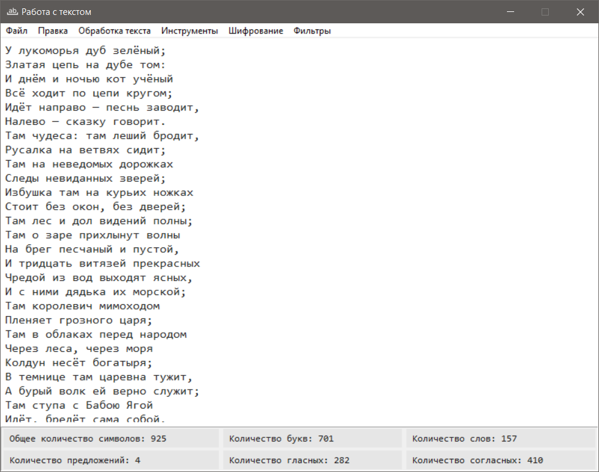
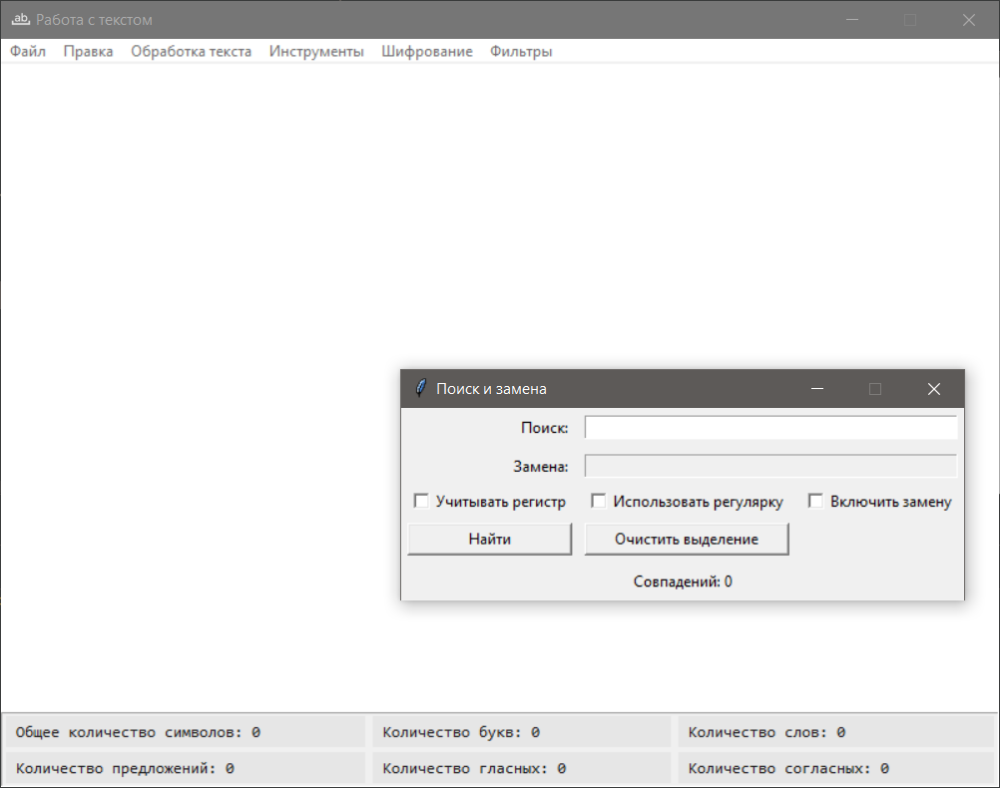
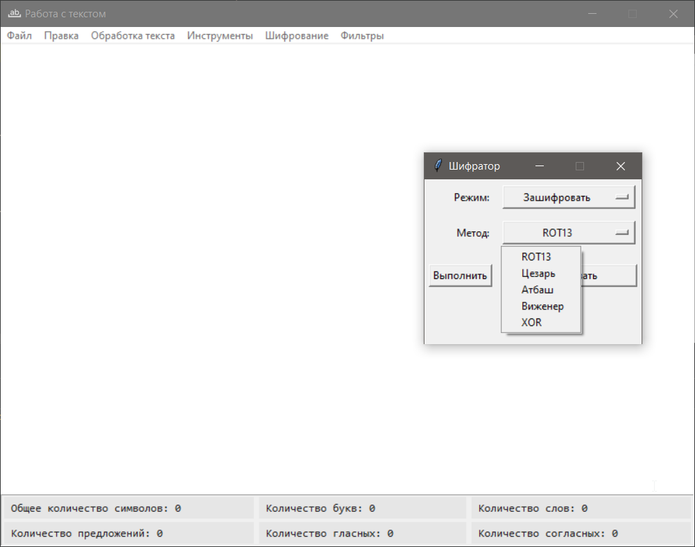

# TextTool

Учебное desktop-приложение на Python с графическим интерфейсом, разработанное для освоения архитектуры **MVC** и работы
с библиотекой **Tkinter**.

Проект представляет собой текстовый редактор с анализом текста и набором инструментов для его обработки.

---

## Кратко о проекте

- Тип проекта: учебный
- Платформа: desktop
- GUI: Tkinter
- Архитектура: MVC (Model–View–Controller)
- Основной фокус: структура приложения и работа с текстом

---

## Содержание

- [Назначение проекта](#назначение-проекта)
- [Возможности](#возможности)
    - [Работа с текстом](#работа-с-текстом)
    - [Статус-бар с анализом текста](#статус-бар-с-анализом-текста)
    - [Меню приложения](#меню-приложения)
    - [Дополнительные окна](#дополнительные-окна)
- [Архитектура](#архитектура)
- [Ограничения проекта](#ограничения-проекта)
- [Скриншоты](#скриншоты)
- [Лицензия](#лицензия)
- [Установка](#установка)
- [Запуск](#запуск)
- [Автор](#автор)

---

## Назначение проекта

Проект является **учебным** и был разработан с целью:

- изучения архитектурного паттерна MVC (Model–View–Controller)
- практики работы с библиотекой Tkinter
- понимания разделения логики, интерфейса и данных
- работы с текстом и строковыми алгоритмами

---

## Возможности

Основной функционал приложения, реализованный в рамках учебного проекта.

### Работа с текстом

Базовые операции редактирования и работы с файлами:

- Ввод и редактирование текста
- Открытие файлов формата TXT и HTML
- Сохранение текста в формате TXT

---

### Статус-бар с анализом текста

В нижней части окна отображается статистика, которая обновляется при изменении текста.

| Параметр    | Описание                  |
|-------------|---------------------------|
| Символы     | Общее количество символов |
| Буквы       | Количество букв           |
| Слова       | Количество слов           |
| Предложения | Количество предложений    |
| Гласные     | Количество гласных        |
| Согласные   | Количество согласных      |

---

### Меню приложения

Меню расположено в верхней части окна и сгруппировано по назначению.

#### Файл

- Открыть TXT / HTML
- Сохранить TXT
- Сохранить как…
- Выход

#### Правка

- Копировать
- Вставить
- Отмена

#### Обработка текста

- Преобразование в верхний регистр
- Преобразование в нижний регистр
- Удаление пустых строк
- Удаление лишних пробелов

#### Инструменты

- Очистка HTML
- Поиск и замена

#### Шифрование

- Зашифровать
- Дешифровать

#### Фильтры

- Оставить только кириллицу
- Оставить только латиницу

---

## Дополнительные окна

Часть функционала вынесена в отдельные окна для упрощения интерфейса:

- Поиск и замена — отдельное окно с логикой поиска и подстановки текста
- Шифрование / дешифрование — отдельное окно для работы с зашифрованным текстом

---

## Архитектура

Проект построен с использованием архитектурного паттерна **MVC**:

- **Model** — логика обработки текста и подсчёта статистики
- **View** — графический интерфейс, реализованный с помощью Tkinter
- **Controller** — связывает пользовательские действия с логикой приложения

Такой подход упрощает поддержку, тестирование и расширение проекта.

---

## Ограничения проекта

Проект не ставит целью:

- создание полнофункционального текстового редактора
- оптимизацию для работы с очень большими файлами
- коммерческое или промышленное использование

---

## Скриншоты

| Окно                                              | Описание                                                      |
|---------------------------------------------------|---------------------------------------------------------------|
|       | Главное окно приложения с текстовым редактором и статус-баром |
|  | Отдельное окно для поиска и замены текста                     |
|          | Окно для шифрования и дешифрования текста                     |

Скриншоты располагаются в папке `screenshots/`.

---

## Лицензия

Проект распространяется под лицензией [MIT](LICENSE).

Лицензия разрешает свободное использование, копирование, изменение и распространение кода при сохранении указания автора и текста лицензии.

---

## Установка

```bash
pip install -r requirements.txt
````

---

## Запуск

```bash
python main.py
```

---

## Автор

Учебный проект, выполненный в рамках самостоятельного изучения Python, Tkinter и архитектуры MVC.

Автор: Akilary  
GitHub: https://github.com/akilary